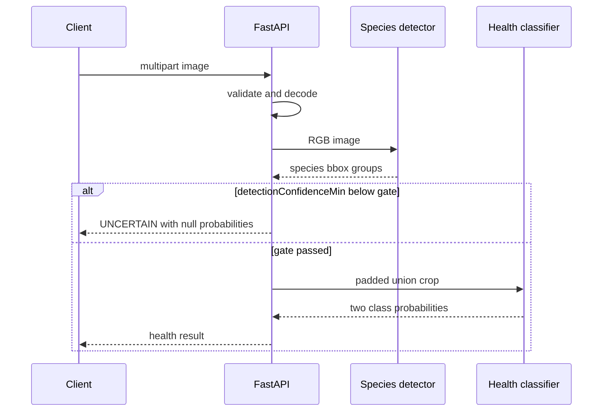

# Mushroom Health Check API v1

## Endpoint

```text
POST /api/v1/mushroom/health-check
Content-Type: multipart/form-data
Field: image
```

지원 형식은 JPG/JPEG, PNG, WEBP입니다. 파일 확장자, MIME type과 실제 이미지
형식이 모두 일치해야 합니다. 애니메이션, 손상 이미지, 빈 파일 및 설정된
byte/pixel 상한을 넘는 이미지는 거부합니다.

업로드 파일은 application storage에 저장하지 않습니다.

## Service probes

| Endpoint | 성공 | 의미 |
| --- | --- | --- |
| `GET /health/live` | `200 {"status":"UP"}` | FastAPI process liveness |
| `GET /health/ready` | `200 {"status":"READY"}` | 두 모델 registry가 준비됨 |
| `GET /health/ready` | `503 {"status":"NOT_READY"}` | 요청을 받을 준비가 안 됨 |

Probe는 모델을 load하거나 추론하지 않고 현재 process 상태만 읽습니다.
Kubernetes liveness와 readiness는 서로 바꾸어 사용하지 않습니다.

## 처리 의미

1. detector가 confidence threshold 이상인 bbox를 찾습니다.
2. 같은 품종 bbox를 하나의 품종 결과로 묶습니다.
3. 모든 bbox의 union에 이미지 크기 기준 padding을 적용합니다.
4. 해당 그룹의 `detectionConfidenceMin`이 minimum detection gate보다
   낮으면 health classifier를 호출하지 않습니다.
5. gate를 통과한 품종만 union crop을 health classifier에 입력합니다.

Gate로 classifier를 호출하지 않은 결과는 다음과 같습니다.

- `healthStatus`: `UNCERTAIN`
- `healthConfidence`: `null`
- `healthyProbability`: `null`
- `diseaseSuspectedProbability`: `null`
- `LOW_DETECTION_CONFIDENCE` warning

이는 classifier가 실행됐지만 두 클래스 confidence가 낮은 `UNCERTAIN`과
구분됩니다. 후자의 경우 health confidence와 두 확률은 숫자입니다.

여러 품종이 있으면 품종별로 독립적으로 gate를 적용합니다. 일부 품종이
gate에 실패해도 다른 품종은 계속 분석합니다.



## Response

응답 JSON key는 camelCase입니다.

```json
{
  "analysisType": "MUSHROOM_HEALTH_CHECK_V1",
  "status": "SUCCESS",
  "detectorModel": "mushroom-yolo11n-camera-holdout-v1",
  "healthModel": "mushroom-health-yolo11n-date-camera-holdout-v1",
  "thresholds": {
    "detection": 0.25,
    "minDetectionConfidence": 0.5,
    "healthUncertain": 0.7
  },
  "results": [
    {
      "species": "느타리",
      "speciesClassId": 0,
      "detectedCount": 1,
      "detectionConfidence": 0.94,
      "detectionConfidenceMin": 0.94,
      "healthStatus": "HEALTHY",
      "healthConfidence": 0.97,
      "healthyProbability": 0.97,
      "diseaseSuspectedProbability": 0.03,
      "bbox": [120, 80, 640, 520],
      "cropBbox": [0, 0, 760, 650]
    }
  ],
  "warnings": [
    "AI 분석 참고 결과이며 확정 진단이 아닙니다."
  ]
}
```

낮은 detector confidence 예시:

```json
{
  "species": "양송이",
  "speciesClassId": 1,
  "detectedCount": 2,
  "detectionConfidence": 0.62,
  "detectionConfidenceMin": 0.43,
  "healthStatus": "UNCERTAIN",
  "healthConfidence": null,
  "healthyProbability": null,
  "diseaseSuspectedProbability": null,
  "bbox": [90, 70, 700, 560],
  "cropBbox": [0, 0, 820, 680]
}
```

## Top-level status

| HTTP | `status` | 의미 |
| ---: | --- | --- |
| 200 | `SUCCESS` | 요청 처리 성공, 하나 이상의 품종 결과 |
| 200 | `NO_MUSHROOM_DETECTED` | detector threshold를 통과한 bbox가 없음 |
| 400 | `INVALID_IMAGE` | 빈 파일, 손상 이미지 또는 pixel 정책 위반 |
| 413 | `INVALID_IMAGE` | upload byte 상한 초과 |
| 415 | `INVALID_IMAGE` | 확장자/MIME/실제 형식 불일치 또는 미지원 |
| 422 | framework validation | multipart `image` 필드 누락 |
| 500 | `INFERENCE_FAILED` | 내부 상세를 숨긴 추론 실패 |

낮은 minimum detection confidence만으로
`NO_MUSHROOM_DETECTED`를 반환하지 않습니다. 탐지된 품종 결과와
`UNCERTAIN`을 반환합니다.

## Warning 정책

warning은 다음 순서와 중복 정책을 따릅니다.

1. 진단 아님 disclaimer는 정확히 한 번
2. 탐지 결과가 없으면 `NO_MUSHROOM_DETECTED` 정확히 한 번
3. 두 품종 이상이면 `MULTIPLE_SPECIES_DETECTED` 정확히 한 번
4. 하나 이상의 품종이 minimum gate에 실패하면
   `LOW_DETECTION_CONFIDENCE` 정확히 한 번
5. classifier가 실행됐지만 health confidence가 낮은 품종마다
   `UNCERTAIN: <species> ...` warning

`LOW_DETECTION_CONFIDENCE`는 품종 수나 낮은 bbox 수만큼 반복하지 않습니다.
Gate 실패 품종에는 health confidence 기반 `UNCERTAIN` warning을 추가하지
않습니다.

## Environment

| 변수 | 기본값 | 범위 |
| --- | ---: | --- |
| `DETECTOR_MODEL_PATH` | approved repository-relative artifact | readable `.pt` |
| `HEALTH_MODEL_PATH` | approved repository-relative artifact | readable `.pt` |
| `HEALTH_DETECTION_CONFIDENCE` | `0.25` | 0~1 |
| `HEALTH_MIN_DETECTION_CONFIDENCE` | `0.50` | 0~1 |
| `HEALTH_UNCERTAIN_THRESHOLD` | `0.70` | 0~1 |
| `HEALTH_PADDING_RATIO` | `0.15` | 0~0.5 |
| `HEALTH_MAX_UPLOAD_BYTES` | `10485760` | 1 byte~100 MiB |
| `HEALTH_VERIFY_MODEL_SHA256` | `true` | boolean |
| `HEALTH_DEVICE` | `auto` | approved runtime device |

Container/Kubernetes에서는 두 model runtime path를 environment로
제공합니다. 실제 값은 배포 파일에서만 설정하고 API 응답에는 노출하지
않습니다.

## Request example

`curl -F`가 multipart boundary를 생성하도록 `Content-Type` header를 직접
덮어쓰지 않습니다.

```bash
curl --fail-with-body \
  --request POST \
  --header "accept: application/json" \
  --form "image=@sample.jpg" \
  http://localhost:8000/api/v1/mushroom/health-check
```

## Client 처리 권장

- `status=NO_MUSHROOM_DETECTED`이면 `results`가 비어 있음을 기대합니다.
- `healthStatus=UNCERTAIN`일 때 probability가 `null`인지 먼저 확인합니다.
- probability가 `null`이면 health classifier가 실행되지 않은 결과입니다.
- Test 또는 확정 진단 결과로 해석하지 않습니다.
- 로컬 절대경로와 stack trace가 응답에 나타나면 보안 오류로 처리합니다.

## 알려진 제한

- 건강 라벨은 촬영 날짜 및 환경 shortcut 위험이 큽니다.
- 현재 결과는 AIHub 내부 촬영 조건을 중심으로 검증했습니다.
- 외부 스마트폰 이미지 일반화가 확인되지 않았습니다.
- disease type과 병반 위치를 반환하지 않습니다.
- 인증, rate limit, ingress body limit은 배포 계층에서 결정해야 합니다.
