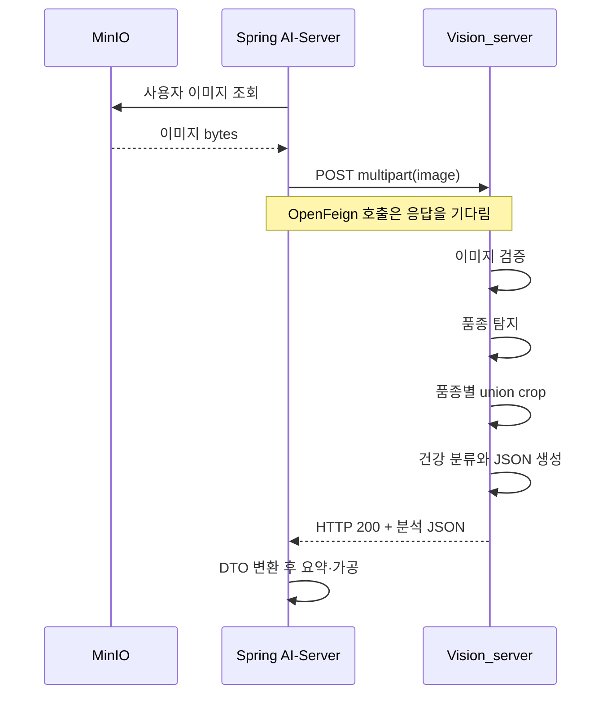

# Mushroom Health Check API v1

## 호출 방식

```text
POST /api/v1/internal/mushrooms/health-check
Content-Type: multipart/form-data
Field: image
```

지원 형식은 JPG/JPEG, PNG, WEBP이고 기본 최대 크기는 10 MiB입니다. 파일
확장자, MIME type과 실제 이미지 형식이 일치해야 합니다. 빈 파일, 손상
이미지, 애니메이션과 byte/pixel 상한을 넘는 이미지는 거부합니다.

Vision_server는 업로드 이미지를 영구 저장하지 않으며 MinIO에서 이미지를
직접 읽지 않습니다. Spring AI-Server가 MinIO에서 읽은 이미지 바이트를
multipart `image` 필드로 전달합니다.

## 동기 요청·응답

이 API는 작업 ID를 돌려주는 비동기 API가 아니라 동기 HTTP API입니다.



`POST` 요청이 FastAPI route의 실행 신호입니다. FastAPI는 multipart에서
`image`를 꺼내 서비스 함수를 호출하고, 분석이 끝난 뒤 반환값을 JSON으로
직렬화합니다. OpenFeign 메서드가 응답 DTO를 반환했다면 Vision 분석이
완료된 것입니다. 별도 완료 조회, polling 또는 callback은 필요하지
않습니다.

AI-Server는 분석 시간보다 충분히 긴 read timeout을 설정하고, timeout과
4xx/5xx 응답을 정상 분석 결과와 구분해야 합니다.

## 분석 의미

1. detector가 confidence 기준을 통과한 버섯 bbox를 찾습니다.
2. 같은 품종의 bbox를 하나의 품종 그룹으로 묶습니다.
3. 그룹 전체의 union bbox에 이미지 크기 기준 padding을 적용합니다.
4. 그룹의 가장 낮은 탐지 confidence가 안전 gate보다 낮으면 건강
   classifier를 실행하지 않습니다.
5. gate를 통과한 품종의 crop만 건강 classifier에 입력합니다.
6. 건강 confidence가 기준보다 낮으면 `UNCERTAIN`으로 반환합니다.

탐지 gate 때문에 classifier를 실행하지 않은 결과는
`healthConfidence`, `healthyProbability`,
`diseaseSuspectedProbability`가 모두 `null`입니다. classifier는
실행됐지만 건강 confidence가 낮은 `UNCERTAIN`은 세 값이 숫자라는 차이가
있습니다.

여러 품종은 독립적으로 처리합니다. 한 품종이 gate에 실패해도 다른 품종
분석은 계속합니다.

## 요청 예시

`curl -F`가 multipart boundary를 만들도록 `Content-Type` header를 직접
덮어쓰지 않습니다.

```bash
curl --fail-with-body \
  --request POST \
  --header "accept: application/json" \
  --form "image=@sample.jpg" \
  http://localhost:8000/api/v1/internal/mushrooms/health-check
```

OpenFeign에서는 파일 필드명이 반드시 `image`여야 합니다. 개념적인 Java
계약은 다음과 같습니다.

```java
@FeignClient(name = "vision-server", url = "${vision-server.url}")
public interface VisionClient {
    @PostMapping(
        value = "/api/v1/internal/mushrooms/health-check",
        consumes = MediaType.MULTIPART_FORM_DATA_VALUE
    )
    VisionResponse analyze(@RequestPart("image") Resource image);
}
```

MinIO에서 읽은 byte array는 filename을 제공하는 `Resource`로 감싸서
전달할 수 있습니다. 실제 AI-Server의 DTO 필드는 아래 camelCase 응답
계약과 맞춰야 합니다.

## 성공 응답

```json
{
  "analysisType": "MUSHROOM_HEALTH_CHECK_V1",
  "status": "SUCCESS",
  "detectorModel": "mushroom-yolo11n-camera-holdout-v1",
  "healthModel": "mushroom-health-yolo11n-date-camera-holdout-v1",
  "thresholds": {
    "detection": 0.25,
    "minDetectionConfidence": 0.5,
    "healthUncertain": 0.7
  },
  "results": [
    {
      "species": "느타리",
      "speciesCode": "OYSTER",
      "speciesClassId": 0,
      "detectedCount": 1,
      "detectionConfidence": 0.94,
      "detectionConfidenceMin": 0.94,
      "healthStatus": "HEALTHY",
      "healthConfidence": 0.97,
      "healthyProbability": 0.97,
      "diseaseSuspectedProbability": 0.03,
      "bbox": [120, 80, 640, 520],
      "cropBbox": [0, 0, 760, 650]
    }
  ],
  "warnings": [
    "AI 분석 참고 결과이며 확정 진단이 아닙니다."
  ]
}
```

응답 JSON key는 camelCase입니다.

| 필드 | 의미 |
| --- | --- |
| `status` | 요청 전체 처리 결과 |
| `results` | 탐지된 품종별 결과 배열 |
| `detectedCount` | 해당 품종으로 탐지된 객체 수 |
| `detectionConfidence` | 품종 그룹의 대표 탐지 confidence |
| `detectionConfidenceMin` | 품종 그룹에서 가장 낮은 confidence |
| `healthStatus` | `HEALTHY`, `DISEASE_SUSPECTED`, `UNCERTAIN` |
| `bbox` | 같은 품종 bbox를 합친 union 좌표 |
| `cropBbox` | padding까지 적용한 건강 분류 입력 영역 |
| `warnings` | 확정 진단 아님, 낮은 confidence 등의 안내 |

탐지 결과가 없으면 HTTP 200과 함께
`status=NO_MUSHROOM_DETECTED`, `results=[]`를 반환합니다. 이는 서버
장애가 아니라 정상적으로 분석을 마친 결과입니다.

## HTTP와 top-level status

| HTTP | `status` | AI-Server 처리 |
| ---: | --- | --- |
| 200 | `SUCCESS` | 품종별 결과를 요약·가공 |
| 200 | `NO_MUSHROOM_DETECTED` | 미탐지 안내, `results=[]` 예상 |
| 400 | `INVALID_IMAGE` | 빈 파일·손상·pixel 정책 오류 |
| 413 | `INVALID_IMAGE` | 업로드 크기 초과 |
| 415 | `INVALID_IMAGE` | 미지원 형식 또는 형식 불일치 |
| 422 | FastAPI validation error | multipart `image` 필드 누락 |
| 429 | `SERVICE_BUSY` | 현재 Pod의 동시 분석 상한 초과, backoff 후 재시도 |
| 500 | `INFERENCE_FAILED` | 요약하지 않고 내부 서비스 오류 처리 |

OpenFeign은 일반적으로 4xx/5xx에서 예외를 발생시키므로 AI-Server에
예외 처리 또는 `ErrorDecoder`가 필요합니다. 연결 실패와 read timeout도
별도 fallback 대상으로 처리합니다. Vision 오류를 정상 진단 문장으로
바꾸면 안 됩니다.

`HEALTH_MAX_INFLIGHT_REQUESTS`는 파일 bytes와 디코딩된 이미지를 동시에
보유할 프로세스별 요청 수를 제한합니다. 용량이 찬 요청은 이미지 처리 전에
429로 빠르게 거부됩니다. 단, FastAPI가 multipart `UploadFile`을 만드는
네트워크 수신 단계는 이 서비스 계층 제한보다 먼저 수행됩니다.

## 상태 확인

| Endpoint | 성공 | 의미 |
| --- | --- | --- |
| `GET /health/live` | `200 {"status":"UP"}` | FastAPI process가 살아 있음 |
| `GET /health/ready` | `200 {"status":"READY"}` | 두 모델이 검증·로드됨 |
| `GET /health/ready` | `503 {"status":"NOT_READY"}` | 분석 요청을 받을 수 없음 |

두 probe는 모델을 새로 load하거나 이미지 추론을 실행하지 않고 현재
프로세스 상태만 읽습니다. Kubernetes liveness와 readiness를 서로 바꾸지
않습니다. AI-Server가 매 분석 요청 전에 probe를 호출할 필요는 없고,
배포 계층이 readiness를 사용해 준비되지 않은 Pod로 트래픽이 가지 않게
합니다.

## 주요 환경 설정

| 변수 | 기본값 | 범위 |
| --- | ---: | --- |
| `DETECTOR_MODEL_PATH` | `runtime/models/detector/best.pt` | readable `.pt` |
| `HEALTH_MODEL_PATH` | `runtime/models/health/best.pt` | readable `.pt` |
| `HEALTH_DETECTION_CONFIDENCE` | `0.25` | 0~1 |
| `HEALTH_MIN_DETECTION_CONFIDENCE` | `0.50` | 0~1 |
| `HEALTH_UNCERTAIN_THRESHOLD` | `0.70` | 0~1 |
| `HEALTH_PADDING_RATIO` | `0.15` | 0~0.5 |
| `HEALTH_MAX_UPLOAD_BYTES` | `10485760` | 1 byte~100 MiB |
| `HEALTH_MAX_INFLIGHT_REQUESTS` | `1` | 1~32 |
| `HEALTH_VERIFY_MODEL_SHA256` | `true` | boolean |
| `HEALTH_DEVICE` | `auto` | 승인된 runtime device |

Container에서는 모델 경로가
`/opt/mushroom-vision/runtime/models/detector/best.pt`와
`/opt/mushroom-vision/runtime/models/health/best.pt`로 설정됩니다. 실제
내부 경로와 stack trace는 API 응답에 노출하지 않습니다.

OpenAPI UI는 `/docs`, schema는 `/openapi.json`에서 확인할 수 있습니다.

## 알려진 제한

- 건강 결과는 확정 진단이나 병명 판정이 아닙니다.
- disease type과 병반 위치를 반환하지 않습니다.
- 외부 스마트폰 사진 일반화는 충분히 검증되지 않았습니다.
- 인증, body limit, rate limit과 timeout은 배포 계층에서도 설정해야 합니다.
