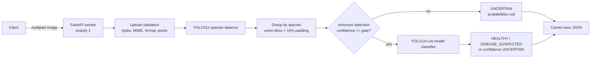
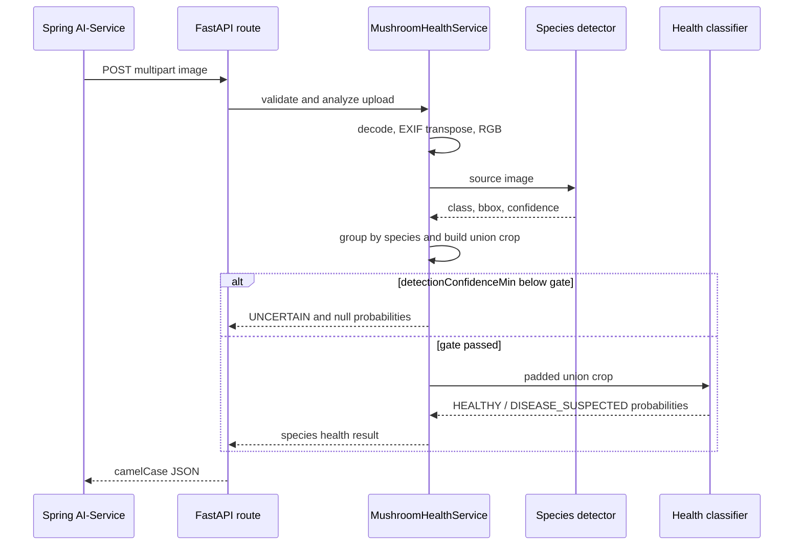
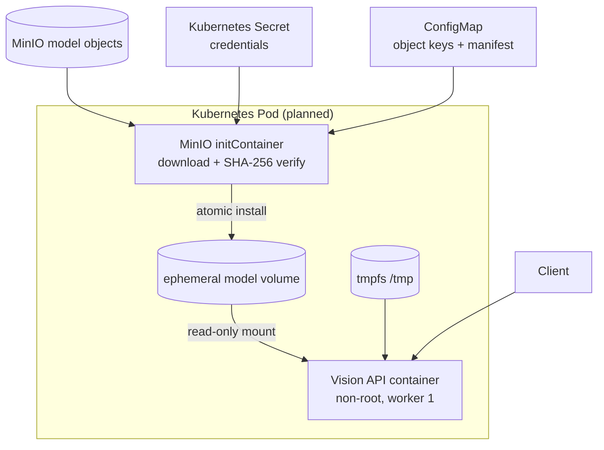

# Mushroom Vision Architecture

## 목적과 범위

Mushroom Vision v1은 한 장의 이미지를 받아 버섯 품종을 탐지하고, 품종별
union crop을 이용해 건강 상태를 참고 정보로 반환하는 단일 FastAPI
서비스입니다.

지원하는 출력은 다음으로 제한됩니다.

- 5품종 탐지, bbox, 개수, 탐지 confidence
- `HEALTHY`, `DISEASE_SUSPECTED`, `UNCERTAIN`
- 품종별 건강 confidence와 두 클래스 확률

수확 적기, 생육 단계, 예상 수확일, 실제 크기, 해충 및 병반 위치는 지원하지
않습니다. 건강 결과도 확정 진단이 아닙니다.

## 런타임 구성

모델은 애플리케이션 lifespan에서 한 번 로드됩니다. `ModelRegistry`는 다음을
확인한 뒤에만 `READY`가 됩니다.

1. detector와 health classifier 파일이 모두 존재함
2. 승인된 SHA-256과 일치함
3. detector 5개 클래스와 classifier 2개 클래스 순서가 일치함
4. 로드 전후 파일 fingerprint가 변하지 않음

로드가 실패하면 lifespan 시작도 실패하므로 요청을 받는 불완전한 서버가
남지 않습니다. worker를 늘리면 worker마다 모델과 GPU 메모리가 복제되므로
항상 worker 1개를 사용합니다.

`GET /health/live`는 프로세스 liveness만, `GET /health/ready`는 registry의
`READY` 상태만 확인합니다. 두 probe 모두 모델 load나 추론을 새로
실행하지 않습니다.

## 요청 처리 순서

1. 파일 확장자와 MIME 조합을 검증합니다.
2. 설정된 byte 상한보다 한 byte만 더 읽어 초과를 판정합니다.
3. Pillow로 실제 형식, 단일 frame, 픽셀 상한, 손상 및 압축폭탄을
   검증합니다.
4. EXIF 방향을 반영하고 RGB로 변환합니다.
5. detector가 품종별 bbox를 반환합니다.
6. 같은 품종의 모든 유효 bbox를 union하고 이미지 크기 기준 padding을
   적용합니다.
7. 품종 그룹의 `detectionConfidenceMin`이
   `HEALTH_MIN_DETECTION_CONFIDENCE`보다 낮으면 classifier를 호출하지
   않습니다. 이 경우 상태는 `UNCERTAIN`, 건강 confidence와 확률은
   `null`입니다.
8. gate를 통과한 품종만 classifier를 한 번 호출합니다.

여러 품종은 서로 독립적으로 gate와 분류를 적용합니다. 탐지 결과가 하나라도
있으면 낮은 confidence gate 때문에 `NO_MUSHROOM_DETECTED`로 바꾸지 않습니다.

## 동시성 경계

이미지 decode와 모델 추론은 전용 thread executor에서 실행됩니다. 하나의
비동기 inference lock이 detector부터 classifier까지 전체 구간을
직렬화합니다. 따라서 같은 프로세스의 모델 객체를 두 요청이 동시에 사용하지
않습니다.

이 lock은 모델 안전성을 위한 것이며 외부 트래픽 제한을 대신하지 않습니다.
배포 계층에서 request body, rate, queue 및 동시 요청 상한을 별도로 정해야
합니다.

## 모델 파일 경계

저장소에는 모델 binary를 커밋하지 않습니다. Git에는
`models/model-manifest.json`만 두고, 팀원이
`scripts/prepare_runtime_models.py`로 검증된 runtime 사본을 준비합니다.

프로토타입 Docker build는 다음 두 파일만 받습니다.

- `runtime/models/detector/best.pt`
- `runtime/models/health/best.pt`

컨테이너에서는 root 소유 read-only 파일이며, API는 non-root로 실행됩니다.
클러스터에서는 이미지에 의존하지 않고 MinIO initContainer가 같은 `/models`
계약의 공유 볼륨을 준비하는 방식을 목표로 합니다.

## 배포 토폴로지

다음 항목은 팀 플랫폼 결정 전까지 확정하지 않습니다.

- `TODO(BASE_IMAGE)`: Python/PyTorch base image와 digest
- `TODO(GPU)`: CPU 또는 GPU node, CUDA 및 device 설정
- `TODO(REGISTRY)`: container registry와 image promotion 규칙
- `TODO(NAMESPACE)`: Kubernetes namespace와 Service/Ingress 이름

## 신뢰 경계와 제한

- 업로드 원본은 애플리케이션 파일로 저장하지 않습니다.
- 외부 JSON에는 host 경로, 모델 경로 및 stack trace를 넣지 않습니다.
- 모델 binary와 MinIO credential은 Git에 넣지 않습니다.
- 현재 성능은 AIHub 내부 촬영 조건에서 검증한 결과입니다.
- 외부 스마트폰 이미지와 버섯이 없는 배경 평가는 별도로 수행해야 합니다.
