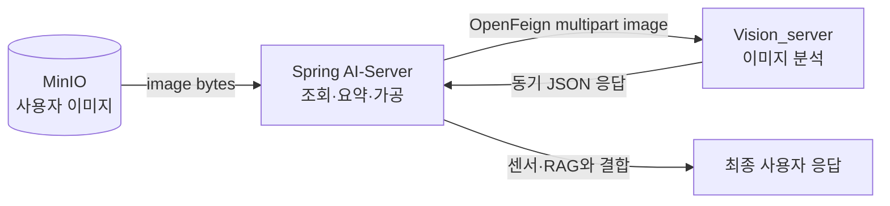
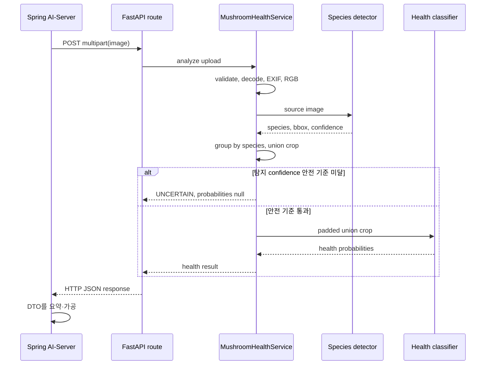
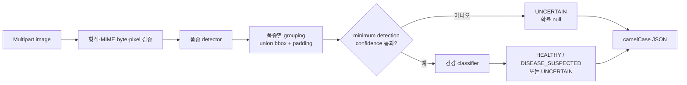
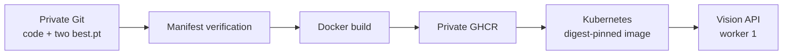

# Mushroom Vision Architecture

## 서비스 경계

Mushroom Vision v1은 한 장의 이미지에서 버섯 품종과 품종별 건강 상태
후보를 계산하는 내부 FastAPI 서비스입니다.



책임은 명확히 분리합니다.

| 구성요소 | 책임 |
| --- | --- |
| MinIO | 사용자가 업로드한 이미지 저장 |
| Spring AI-Server | MinIO 조회, multipart 요청, Vision 결과와 다른 정보의 요약·가공 |
| Vision_server | 업로드 검증, 두 모델 추론, 구조화된 결과 반환 |
| private Git/GHCR | Vision 코드·모델의 버전 관리와 배포 |

Vision_server는 MinIO endpoint, bucket, object key 또는 credential을 알지
않습니다. 반대로 AI-Server는 `.pt` 파일과 Python 추론 구현을 관리하지
않습니다.

## 요청이 자동 실행되는 구조

FastAPI가 다음 route를 등록한 상태로 Uvicorn이 요청을 기다립니다.

```text
POST /api/v1/internal/mushrooms/health-check
```

OpenFeign이 이 URL로 multipart `image`를 보내면 FastAPI가 route를 찾아
업로드 객체와 서비스 의존성을 전달합니다. route가
`MushroomHealthService`를 호출하고, 서비스가 predictor를 호출하므로
요청 자체가 전체 분석 흐름의 시작 신호가 됩니다.



route는 분석 도중 HTTP 응답을 먼저 보내지 않습니다. Vision_server가
분석 JSON을 반환할 때까지 OpenFeign 호출은 대기합니다. 따라서 OpenFeign
메서드가 반환되는 시점이 분석 완료 시점입니다.

## Vision_server 내부 구조

```text
app/main.py
  └─ lifespan
      └─ ModelRegistry.load()
          ├─ detector 파일·SHA·class mapping 검증 및 로드
          └─ health classifier 파일·SHA·class mapping 검증 및 로드

app/api/health.py
  └─ MushroomHealthService
      ├─ 업로드 형식·크기·pixel 검증
      └─ scripts/predict_mushroom_health.py
          ├─ 품종 탐지
          ├─ 품종별 union crop
          └─ 건강 분류와 confidence 규칙
```

각 계층의 책임은 다음과 같습니다.

| 코드 | 책임 |
| --- | --- |
| `app/main.py` | 앱 생성, router 등록, 시작·종료 생명주기 |
| `app/api/health.py` | HTTP 입력·출력과 안전한 오류 변환 |
| `app/services/mushroom_health_service.py` | 이미지 검증과 추론 orchestration |
| `scripts/predict_mushroom_health.py` | 모델별 실제 추론 알고리즘 |
| `app/core/model_registry.py` | 프로세스당 모델 한 쌍 관리 |
| `app/core/config.py` | 환경변수 파싱과 범위 검증 |
| `app/schemas/*.py` | camelCase 외부 계약 |

route에 YOLO 로직을 다시 작성하지 않고 service와 predictor를 재사용합니다.

## 모델 생명주기와 readiness

두 모델은 private Git의 다음 경로에서 코드와 함께 관리합니다.

```text
runtime/models/detector/best.pt
runtime/models/health/best.pt
```

개발·CI build 전에 `make verify-models`가 두 파일을
`models/model-manifest.json`의 크기와 SHA-256에 대조합니다. 컨테이너
시작 시에는 `ModelRegistry`가 다시 다음 조건을 확인합니다.

1. 두 파일이 모두 존재함
2. 승인된 SHA-256과 일치함
3. detector 5개와 classifier 2개 클래스 순서가 일치함
4. 로드 전후 파일 fingerprint가 변하지 않음

모두 성공한 뒤에만 registry가 `READY`가 됩니다. 모델은 요청마다 로드하지
않고 애플리케이션 시작 시 한 번만 메모리에 올립니다.

- `GET /health/live`: FastAPI process liveness
- `GET /health/ready`: 현재 registry가 `READY`인지 확인

두 probe는 모델을 새로 로드하거나 추론하지 않습니다.

## 이미지 분석 흐름



같은 품종 객체가 여러 개면 해당 품종의 bbox를 모두 합친 crop을 한 번
분류합니다. 서로 다른 품종은 각각 독립 결과로 반환합니다.

## 동시성과 worker 계약

이미지 decode와 모델 추론은 event loop 밖의 thread executor에서
실행됩니다. 하나의 비동기 inference lock이 detector부터 classifier까지를
직렬화하여 같은 프로세스의 모델 객체를 두 요청이 동시에 사용하지 않게
합니다.

모델은 process-local singleton이므로 Uvicorn worker마다 두 모델과 GPU
메모리가 복제됩니다. 현재 배포 계약은 반드시 worker 1개입니다. 처리량이
부족하면 먼저 latency·메모리를 측정하고 Pod 수와 요청 queue를 설계해야
합니다.

## 모델 배포 구조



Docker image는 코드, predictor, manifest와 두 모델을 함께 포함합니다.
런타임에는 image에 포함된 모델만 사용합니다. 모델 변경은 새 Git commit,
검증, 새 image와 새 digest 배포로 처리합니다.

이 방식의 상세 규칙은 [모델 관리](MODEL_MANAGEMENT.md), 배포 설정은
[CI/CD 인계](CI_CD_HANDOFF.md)를 확인하세요.

## 신뢰 경계

- 업로드 원본을 Vision_server의 파일로 저장하지 않습니다.
- 응답에 stack trace, host 경로와 모델 경로를 노출하지 않습니다.
- private 저장소와 private GHCR에만 모델을 둡니다.
- registry credential은 CI/CD와 Kubernetes Secret에만 둡니다.
- 모델 파일은 실행 중 교체하지 않습니다.
- 건강 결과를 확정 진단으로 표현하지 않습니다.
