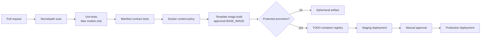
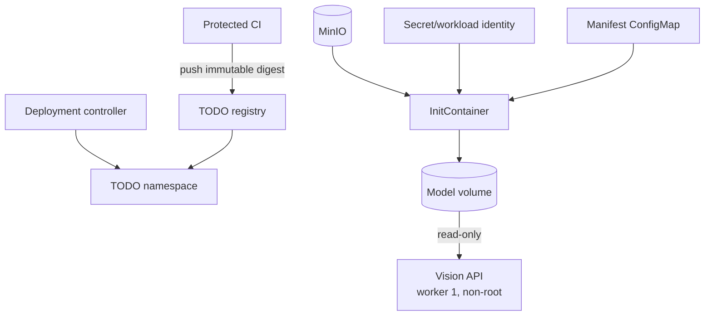

# CI/CD Handoff

## 현재 저장소 단서

- organization ownership, 대상 branch, branch protection 및 reviewer 정책은
  아직 이 저장소에 선언되어 있지 않습니다.
- application, tests 및 일부 Markdown/JSON 보고서는 Git으로 추적합니다.
- `.env`, `artifacts/`, dataset 디렉터리 및 `*.pt`는 Git에서 제외합니다.
- Python packaging lock, CI workflow 및 배포 manifest는 아직 없습니다.
- Docker 관련 파일은 prototype이며 production 배포 승인을 의미하지 않습니다.

외부 sample image나 OS metadata 정리는 서비스 인프라 PR에 포함하지 않습니다.

## 배포 계약

| 항목 | 값 또는 권장안 |
| --- | --- |
| 서비스명 | `mushroom-vision-service` |
| container port | `8000` |
| Uvicorn workers | `1` |
| Kubernetes Service | 내부 `ClusterIP` 권장 |
| 내부 주소 예 | `http://mushroom-vision-service:8000` |
| 분석 API | `POST /api/v1/mushroom/health-check` |
| liveness | `GET /health/live` |
| readiness | `GET /health/ready` |

Spring AI-Service만 ClusterIP를 통해 호출하는 구성을 기본으로 검토합니다.
외부 직접 공개, 인증, Ingress와 NetworkPolicy는 플랫폼·보안 팀 승인 전에는
확정하지 않습니다.

## Dependency files

- `requirements-common.txt`: OS와 accelerator에 독립적인 API·추론 direct
  dependency
- `requirements-macos.txt`: Apple Silicon host용 common dependency와
  `torch==2.11.0`, `torchvision==0.26.0`
- `requirements-runtime.txt`: Linux container용 common dependency include;
  PyTorch와 torchvision은 승인된 base image가 제공
- `requirements-dev.txt`: 선택한 platform runtime에 추가하는 pytest 등
  개발·테스트 dependency

Mac job은 `requirements-macos.txt`와 `requirements-dev.txt`를 함께
사용합니다. CUDA local version suffix가 붙은 wheel 또는 CUDA package
index를 macOS job에 설치하지 않습니다.

Linux CPU와 Linux CUDA는 같은 dependency 이름을 사용하더라도 별도 배포
profile입니다. `TODO(BASE_IMAGE)`와 `TODO(GPU)`가 결정되면 각 profile의
base digest, CPU/CUDA runtime, 아키텍처, PyTorch/torchvision 버전을 한
세트로 검증하고 release 증거에 남깁니다. `requirements-runtime.txt`만
bare host에 설치해 완전한 추론 환경이 된다고 가정하지 않습니다.

Mac profile은 현재 검증 환경과 같은 release pair인 PyTorch 2.11 /
torchvision 0.26을 사용하되 CUDA suffix는 사용하지 않습니다. Linux
base의 CUDA build suffix와 driver 조합은 별도 승인 대상입니다. Linux
base가 이 release pair와 다른 버전을 쓰려면 같은 두 `best.pt`로 보호된
registry/API integration을 다시 통과한 증거가 필요합니다.

## 제안 브랜치와 PR 경계

1. `dev`에서 짧은 infrastructure feature branch를 만듭니다.
2. model manifest/prepare script, dependency files, Docker template, 문서와
   테스트를 논리적인 작은 commit으로 나눕니다.
3. 모델 binary, `.env`, dataset 및 generated artifact가 staged되지 않았는지
   확인합니다.
4. 최소 한 명의 reviewer와 CI 통과 후 `dev`로 merge합니다.
5. release 후보만 별도 승인으로 `main`에 promotion합니다.

`main`과 `dev`의 protection, required reviewers 및 merge 방식은
`TODO(GIT_POLICY)`로 두고 팀 owner가 결정해야 합니다.

## CI 파이프라인



### Pull request 필수 단계

- Python 3.12 syntax/import 검사
- `pytest -q` 기본 suite
- 실제 model load test가 skip 상태인지 확인
- manifest JSON schema와 predictor 계약 일치
- prepare script synthetic atomicity/immutability 테스트
- `.dockerignore` allowlist에 `.env`, dataset, reports 및 임의 `.pt`가
  포함되지 않는지 검사
- Dockerfile이 worker 1, non-root, 고정 runtime 경로를 유지하는지 정적 검사
- 문서와 manifest에 host 절대경로 및 credential이 없는지 검사

CI 기본 job은 실제 모델을 다운로드하거나 load하지 않습니다.

### 플랫폼별 CI 역할

| lane | dependency/runtime | 허용 검증 | 금지 또는 제한 |
| --- | --- | --- | --- |
| macOS arm64 | `requirements-macos.txt` + `requirements-dev.txt` | syntax, fake-model unit/API test, 경로·manifest 정적 검사 | CUDA wheel/index 설치 금지; 일반 shared runner에서 MPS와 실제 모델 성능을 보장하지 않음 |
| Linux CPU | 승인된 CPU PyTorch/torchvision base + `requirements-runtime.txt` | unit/API test, CPU container startup 및 opt-in 모델 smoke | CUDA 동작을 검증했다고 해석하지 않음 |
| Linux CUDA | 승인된 CUDA base + `requirements-runtime.txt` + NVIDIA runner | 보호된 실제 모델 integration, CUDA startup/inference smoke | 일반 PR과 credential 없는 runner에서 실행 금지 |

Apple Silicon MPS 실제 모델 검증이 필요하면 승인 모델을 제공할 수 있는 전용
Mac runner에서만 보호된 opt-in job으로 실행합니다. 해당 job은
`torch.backends.mps.is_available()`을 먼저 확인하고 실제 선택 device를
로그에 남겨야 합니다. `make doctor-mac`의 path-safe 결과를 진단 증거로
사용할 수 있습니다. MPS가 없는 일반 Mac CI에서 CPU로 자동 대체된 성공을
MPS 검증 성공으로 기록하지 않습니다.

다음 항목은 CI owner가 확정해야 합니다.

- `TODO(MAC_RUNNER)`: Apple Silicon 전용 runner와 MPS 검증 필요 여부
- `TODO(MAC_WHEEL_SOURCE)`: 승인된 macOS arm64 wheel source와 cache 정책
- `TODO(LINUX_CPU_BASE)`: CPU base image digest와 대상 아키텍처
- `TODO(LINUX_CUDA_BASE)`: CUDA base image digest, driver/runtime 호환표
- `TODO(PLATFORM_LOCK)`: platform별 transitive lock 또는 hash 정책
- `TODO(MODEL_CREDENTIAL)`: 보호된 integration job의 모델 공급 방식

### 보호된 통합 단계

다음 단계는 승인된 runner와 model credential이 있을 때만 실행합니다.

- MinIO에서 immutable version object 준비
- SHA-256 검증과 runtime staging
- `RUN_MODEL_INTEGRATION_TESTS=true` registry smoke test
- image build 및 startup smoke test
- `/health/live`, `/health/ready` probe와 synthetic API 요청

credential은 masked CI secret 또는 workload identity로만 제공합니다. shell
trace와 artifact에 secret 값, source URL 및 presigned URL을 남기지 않습니다.

## Docker build 계약

`Dockerfile.template`은 `ARG BASE_IMAGE`에 기본값을 두지 않습니다.

- `TODO(BASE_IMAGE)`: Python 3.12와 승인된 PyTorch/torchvision 조합을
  제공하는 Linux CPU 또는 CUDA digest
- `TODO(GPU)`: target이 CPU인지 GPU인지와 CUDA/driver/runtime compatibility
- `TODO(REGISTRY)`: image registry, repository 및 retention
- `TODO(NVIDIA_DEVICE_PLUGIN)`: GPU 사용 시 cluster 설치·버전·node label 확인

Java Spring 서비스 Dockerfile은 repository layout, image naming 및 CI stage
구성을 참고할 수 있습니다. 그러나 Vision 서비스의 Python/PyTorch
`BASE_IMAGE`는 Java base image에서 유추하지 않고 별도로 승인해야 합니다.
Java image tag, JVM 옵션 또는 Java 사용자 구성을 Vision template에 복사하지
않습니다.

CPU와 CUDA 이미지는 동일한 임의 base tag를 공유하는 하나의 profile로
취급하지 않습니다. 각각 immutable digest와 테스트 증거를 갖는 별도
profile로 build·tag·promotion합니다. base가 제공하는
PyTorch/torchvision 버전은 애플리케이션 계약과 일치해야 하며
`requirements-runtime.txt`가 accelerator wheel을 다시 설치하지 않습니다.

Docker Desktop for Mac은 Linux VM 기반이므로 Apple Metal/MPS를 이
container에 전달하지 않습니다. Mac host의 MPS 검증은
`Dockerfile.template`이 아니라 host virtual environment에서 수행합니다.
Mac에서 Linux image를 cross-build했다는 사실은 Linux CUDA startup 또는
GPU inference 검증 증거가 아닙니다. CUDA image는 대상 Linux/NVIDIA
runner에서 build하고 검증합니다.

예상 build 진입점은 Make target입니다.

```bash
make prepare-models
make check-models
make docker-build BASE_IMAGE=<team-approved-image-or-digest>
```

build 전에 다음 두 파일이 존재하고 manifest의 크기·SHA-256과 일치해야
합니다.

- `runtime/models/detector/best.pt`
- `runtime/models/health/best.pt`

template은 검증된 두 runtime model만 image layer에 넣으며 non-root API가
수정할 수 없게 root 소유 read-only로 둡니다. 운영에서는 image도
read-only root filesystem으로 실행하고 `/tmp`만 제한된 tmpfs로 제공합니다.

## Kubernetes/MinIO handoff



플랫폼 팀 handoff 항목:

- `TODO(NAMESPACE)`: namespace와 quota
- `TODO(SERVICE_ACCOUNT)`: workload identity
- `TODO(MINIO_*)`: endpoint, bucket, versioned keys, credential source
- `TODO(RESOURCES)`: CPU, memory, ephemeral storage 및 GPU request/limit
- `TODO(INGRESS)`: authentication, body limit, timeout 및 rate limit
- `TODO(OBSERVABILITY)`: metrics, structured logs, tracing 및 alert
- `TODO(ROLLBACK)`: image digest와 model object version을 함께 rollback하는
  절차

Pod security 기준:

- `runAsNonRoot: true`
- `allowPrivilegeEscalation: false`
- root filesystem read-only
- Linux capabilities 모두 drop
- `seccompProfile: RuntimeDefault`
- application model volume `readOnly: true`
- worker 1
- writable 경로는 크기 제한된 `/tmp`만 허용

initContainer가 두 checksum을 모두 검증하기 전에는 application container를
시작하지 않습니다.

## Environment와 Secret

`.env.example`에는 공개 가능한 기본 설정과 변수 이름만 둡니다. 실제 `.env`,
MinIO credential 및 registry credential은 Git에 넣지 않습니다.

배포 환경은 최소한 다음을 명시합니다.

- `DETECTOR_MODEL_PATH=/models/detector/best.pt`
- `HEALTH_MODEL_PATH=/models/health/best.pt`
- `HEALTH_DETECTION_CONFIDENCE`
- `HEALTH_MIN_DETECTION_CONFIDENCE`
- `HEALTH_UNCERTAIN_THRESHOLD`
- `HEALTH_PADDING_RATIO`
- `HEALTH_MAX_UPLOAD_BYTES`
- `HEALTH_VERIFY_MODEL_SHA256=true`
- `HEALTH_DEVICE`

production에서 SHA 검증을 끄지 않습니다.

## Release 증거

release마다 다음을 보존합니다.

- Git commit SHA
- container image digest
- model manifest version과 두 model SHA-256
- dependency lock 또는 approved base digest
- unit/integration test 결과
- API contract version
- 승인자와 rollback 대상

이 정보에는 host 절대경로나 secret을 포함하지 않습니다.
