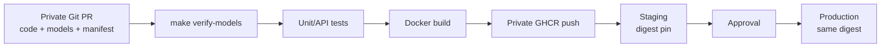
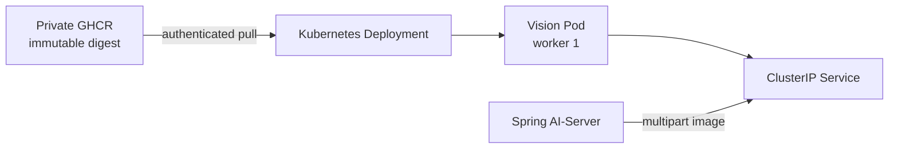

# CI/CD Handoff

## 배포 계약

| 항목 | 값 또는 원칙 |
| --- | --- |
| 서비스명 | `mushroom-vision-service` |
| container port | `8000` |
| Uvicorn workers | `1` |
| 분석 API | `POST /api/v1/internal/mushrooms/health-check` |
| liveness | `GET /health/live` |
| readiness | `GET /health/ready` |
| image registry | private GitHub Container Registry(GHCR) |
| 배포 기준 | image tag가 아닌 immutable digest |
| 모델 공급 | private Git의 두 `best.pt`를 image에 포함 |

Spring AI-Server만 내부 Service를 통해 Vision_server를 호출하는 구성을
기본으로 합니다. Vision endpoint를 외부에 직접 공개할지는 보안·플랫폼
검토 후 결정합니다.

## 확정된 모델 배포 흐름



MinIO는 사용자 이미지 저장소이며 CI/CD 모델 공급 경로가 아닙니다.
별도 모델 다운로드 단계 없이 코드, manifest와 두 모델을 하나의 image
release로 취급합니다.

## 저장소와 package 권한

- Vision_server repository와 GHCR package를 private으로 유지합니다.
- GitHub Actions의 기본 권한은 read-only로 두고 image 게시 job에만
  `packages: write`와 필요한 최소 `contents: read`를 부여합니다.
- pull request job에는 package push 권한과 production 환경 secret을 주지
  않습니다.
- Kubernetes에는 private GHCR pull에 필요한 최소 권한만 부여합니다.
- registry token, image pull secret과 GitHub credential을 repository
  파일·`.env.example`·로그에 남기지 않습니다.
- 모델 공개 가능 여부가 별도로 승인되기 전 repository/package visibility를
  public으로 바꾸지 않습니다.

organization, branch protection, reviewer 수와 environment approval 정책은
CI/CD 팀이 저장소 정책으로 확정해야 합니다.

## Pull request CI

일반 PR에서 최소한 다음 순서로 검증합니다.

1. Python 3.12를 준비하고 torch 없는 `requirements-common.txt`와
   `requirements-dev.txt` 설치
2. `make verify-models`
3. 남아 있는 전체 핵심 `pytest` 실행
4. manifest와 predictor의 model name, size, SHA-256, class mapping 계약 확인
5. Docker build context에 dataset, 외부 이미지, `.env`, cache와 Git
   metadata가 들어가지 않는지 확인
6. Dockerfile의 worker 1, non-root, 고정 model path와 SHA 검증 설정 확인

승인된 Linux base image를 사용하는 실제 image build는 이 PR gate를 통과해
main에 반영된 뒤 publish job에서 수행합니다. 조직 정책상 PR 단계의 image
build까지 필수라면, 승인 base에 접근할 수 있는 별도 protected runner check를
추가합니다.

private repository checkout에 두 `best.pt`가 포함되므로 별도 모델
다운로드 secret이나 네트워크 단계가 없어야 합니다. `make verify-models`는
파일을 수정하지 않는 검증 단계입니다.

기본 테스트는 실제 weight를 Ultralytics로 load하지 않고 fake model을
사용하며, 두 binary는 manifest 검증 과정에서 크기와 SHA-256만 읽습니다.
실제 model load smoke test는 모델과 필요한 accelerator를 제공하는 승인
runner에서만 다음처럼 실행합니다.

```bash
RUN_MODEL_INTEGRATION_TESTS=true \
python -m pytest -q tests/test_model_registry.py -k integration
```

## 플랫폼별 검증

| lane | runtime | 검증 범위 |
| --- | --- | --- |
| GitHub hosted PR | `requirements-common.txt` + `requirements-dev.txt` | torch 없는 전체 fake-model/API/manifest gate |
| macOS arm64 | `requirements-macos.txt` + `requirements-dev.txt` | fake-model 테스트, 모델 manifest 검증, 선택적 CPU/MPS smoke |
| Linux CPU | 승인된 CPU PyTorch base + `requirements-runtime.txt` | image startup, model load, API smoke |
| Linux CUDA | 승인된 CUDA base + `requirements-runtime.txt` | NVIDIA runner에서 CUDA startup/inference |

Linux CPU와 CUDA image는 별도 base digest와 테스트 증거를 갖는 별도
profile입니다. CUDA image를 일반 runner에서 build한 사실만으로 GPU 추론을
검증했다고 기록하지 않습니다.

확정이 필요한 값:

- `TODO(LINUX_CPU_BASE)`: Python/PyTorch CPU base image digest
- `TODO(LINUX_CUDA_BASE)`: CUDA base image digest와 driver 호환 범위
- `TODO(TARGET_PROFILE)`: 최초 배포가 CPU인지 CUDA인지
- `TODO(GHCR_NAME)`: `ghcr.io/<organization>/<package>`
- `TODO(GIT_POLICY)`: 보호 branch, reviewer와 merge 정책
- `TODO(RUNNERS)`: 실제 model CPU/CUDA/MPS 검증 runner

## Docker build 계약

`Dockerfile`은 `BASE_IMAGE`를 명시적으로 받습니다. 승인된 base는
Python 3.12와 서로 호환되는 PyTorch/torchvision을 제공해야 합니다.
`requirements-runtime.txt`가 accelerator용 PyTorch를 임의로 교체하면 안
됩니다. pull request의 hosted test job은 Ultralytics/PyTorch를 설치하지
않고 전체 핵심 테스트를 통과시킵니다. GHCR publish job은 이 test job이
성공한 push 또는 수동 실행에서만 `packages: write` 권한을 받습니다.

```bash
make verify-models
make docker-build \
  BASE_IMAGE=<approved-python-pytorch-image-or-digest> \
  IMAGE_NAME=ghcr.io/<organization>/vision-server:<tag>
```

image에 포함하는 저장소 파일은 최소화합니다.

- `app/`
- `scripts/predict_mushroom_health.py`
- `scripts/verify_runtime_models.py`
- `models/model-manifest.json`
- `runtime/models/detector/best.pt`
- `runtime/models/health/best.pt`
- runtime requirements

학습·평가 자료, reports, tests, `.git`, `.env`, 외부 이미지와 사용자
업로드를 image에 포함하지 않습니다.

Container runtime 계약:

- numeric non-root user
- read-only root filesystem
- image에 포함된 `runtime/models` 경로는 애플리케이션이 수정할 수 없음
- 제한된 writable `/tmp`
- `HEALTH_VERIFY_MODEL_SHA256=true`
- Uvicorn worker 1

## GHCR 게시와 tag

사람이 읽는 release tag에는 서비스와 모델 bundle 버전을 함께 남깁니다.

```text
ghcr.io/<organization>/vision-server:0.1.0-model-v1
```

같은 build에 Git commit tag를 추가할 수 있지만 `latest`만으로 promotion
또는 rollback하지 않습니다. CI가 image를 push한 뒤 registry가 반환한
digest를 release evidence로 저장합니다.

권장 promotion:

```text
PR 검증
→ protected branch/release에서 image 1회 build
→ private GHCR push
→ 그 digest를 staging에 배포
→ smoke와 승인
→ 같은 digest를 production에 배포
```

staging과 production 사이에서 image를 다시 build하지 않습니다.

## Kubernetes handoff



Deployment image는 다음 형태로 고정합니다.

```text
ghcr.io/<organization>/vision-server@sha256:<image-digest>
```

필수 운영 설정:

- `DETECTOR_MODEL_PATH=/opt/mushroom-vision/runtime/models/detector/best.pt`
- `HEALTH_MODEL_PATH=/opt/mushroom-vision/runtime/models/health/best.pt`
- `HEALTH_VERIFY_MODEL_SHA256=true`
- `HEALTH_DEVICE=cpu` 또는 승인된 `cuda:0`
- liveness `/health/live`
- readiness `/health/ready`
- replica별 Uvicorn worker 1

Pod security 권장값:

- `runAsNonRoot: true`
- `allowPrivilegeEscalation: false`
- `readOnlyRootFilesystem: true`
- Linux capabilities 모두 drop
- `seccompProfile: RuntimeDefault`
- 크기 제한된 `/tmp`만 writable

플랫폼 팀이 정할 값:

- `TODO(NAMESPACE)`: namespace와 quota
- `TODO(SERVICE_ACCOUNT)`: GHCR pull identity
- `TODO(RESOURCES)`: CPU, memory, ephemeral storage와 GPU
- `TODO(NETWORK_POLICY)`: AI-Server에서 Vision Service로의 접근
- `TODO(TIMEOUT)`: Vision 최대 처리시간을 반영한 ingress/client timeout
- `TODO(OBSERVABILITY)`: logs, metrics, tracing과 alert

## 배포 smoke test

새 Pod가 뜬 뒤 순서대로 확인합니다.

```bash
curl --fail http://<vision-service>:8000/health/live
curl --fail http://<vision-service>:8000/health/ready

curl --fail-with-body \
  --form "image=@approved-smoke-image.jpg" \
  http://<vision-service>:8000/api/v1/internal/mushrooms/health-check
```

확인 항목:

- readiness가 두 모델 load 후에만 200인지
- API가 camelCase 계약을 반환하는지
- 시작 로그에 model name과 실제 device가 맞는지
- 로그와 응답에 credential, host 경로와 stack trace가 없는지
- Spring AI-Server의 OpenFeign timeout과 오류 처리가 동작하는지

## release evidence와 rollback

release마다 다음을 보존합니다.

- Git commit SHA
- detector·health model version과 두 model SHA-256
- base image digest와 dependency 정보
- Vision image tag와 최종 image digest
- unit/integration/smoke test 결과
- 배포 환경, 승인자와 배포 시각
- 직전 정상 image digest

rollback은 모델 object를 따로 되돌리는 작업이 아닙니다. Deployment의
image를 직전 정상 digest로 바꾸고 새 Pod의 readiness를 확인하면 코드와
모델이 함께 되돌아갑니다.
