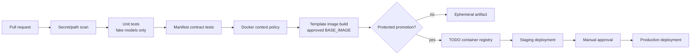
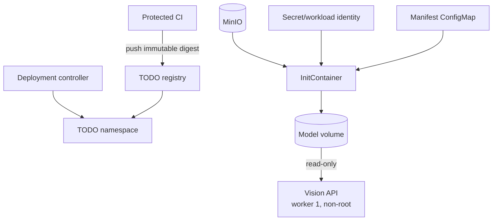

# CI/CD Handoff

## 현재 저장소 단서

- organization ownership, 대상 branch, branch protection 및 reviewer 정책은
  아직 이 저장소에 선언되어 있지 않습니다.
- application, tests 및 일부 Markdown/JSON 보고서는 Git으로 추적합니다.
- `.env`, `artifacts/`, dataset 디렉터리 및 `*.pt`는 Git에서 제외합니다.
- Python packaging lock, CI workflow 및 배포 manifest는 아직 없습니다.
- Docker 관련 파일은 prototype이며 production 배포 승인을 의미하지 않습니다.

외부 sample image나 OS metadata 정리는 서비스 인프라 PR에 포함하지 않습니다.

## 배포 계약

| 항목 | 값 또는 권장안 |
| --- | --- |
| 서비스명 | `mushroom-vision-service` |
| container port | `8000` |
| Uvicorn workers | `1` |
| Kubernetes Service | 내부 `ClusterIP` 권장 |
| 내부 주소 예 | `http://mushroom-vision-service:8000` |
| 분석 API | `POST /api/v1/mushroom/health-check` |
| liveness | `GET /health/live` |
| readiness | `GET /health/ready` |

Spring AI-Service만 ClusterIP를 통해 호출하는 구성을 기본으로 검토합니다.
외부 직접 공개, 인증, Ingress와 NetworkPolicy는 플랫폼·보안 팀 승인 전에는
확정하지 않습니다.

## Dependency files

- `requirements-runtime.txt`: API와 추론 runtime의 검증된 direct version
- `requirements-dev.txt`: runtime을 포함하고 pytest를 추가한 기본 test 환경

현재 CUDA suffix가 붙은 PyTorch pin은 확인된 prototype 환경을 기록한
것입니다. 다른 package index에서 자동으로 호환된다고 가정하지 않습니다.
`TODO(BASE_IMAGE)`와 `TODO(GPU)`가 결정되면 base digest, PyTorch wheel
index와 requirements를 한 세트로 검증하고 release 증거에 남깁니다.

## 제안 브랜치와 PR 경계

1. `dev`에서 짧은 infrastructure feature branch를 만듭니다.
2. model manifest/prepare script, dependency files, Docker template, 문서와
   테스트를 논리적인 작은 commit으로 나눕니다.
3. 모델 binary, `.env`, dataset 및 generated artifact가 staged되지 않았는지
   확인합니다.
4. 최소 한 명의 reviewer와 CI 통과 후 `dev`로 merge합니다.
5. release 후보만 별도 승인으로 `main`에 promotion합니다.

`main`과 `dev`의 protection, required reviewers 및 merge 방식은
`TODO(GIT_POLICY)`로 두고 팀 owner가 결정해야 합니다.

## CI 파이프라인



### Pull request 필수 단계

- Python 3.12 syntax/import 검사
- `pytest -q` 기본 suite
- 실제 model load test가 skip 상태인지 확인
- manifest JSON schema와 predictor 계약 일치
- prepare script synthetic atomicity/immutability 테스트
- `.dockerignore` allowlist에 `.env`, dataset, reports 및 임의 `.pt`가
  포함되지 않는지 검사
- Dockerfile이 worker 1, non-root, 고정 runtime 경로를 유지하는지 정적 검사
- 문서와 manifest에 host 절대경로 및 credential이 없는지 검사

CI 기본 job은 실제 모델을 다운로드하거나 load하지 않습니다.

### 보호된 통합 단계

다음 단계는 승인된 runner와 model credential이 있을 때만 실행합니다.

- MinIO에서 immutable version object 준비
- SHA-256 검증과 runtime staging
- `RUN_MODEL_INTEGRATION_TESTS=true` registry smoke test
- image build 및 startup smoke test
- `/health/live`, `/health/ready` probe와 synthetic API 요청

credential은 masked CI secret 또는 workload identity로만 제공합니다. shell
trace와 artifact에 secret 값, source URL 및 presigned URL을 남기지 않습니다.

## Docker build 계약

`Dockerfile.template`은 `ARG BASE_IMAGE`에 기본값을 두지 않습니다.

- `TODO(BASE_IMAGE)`: Python 3.12와 pinned PyTorch 조합을 제공하는 digest
- `TODO(GPU)`: target이 CPU인지 GPU인지와 CUDA/runtime compatibility
- `TODO(REGISTRY)`: image registry, repository 및 retention
- `TODO(NVIDIA_DEVICE_PLUGIN)`: GPU 사용 시 cluster 설치·버전·node label 확인

Java Spring 서비스 Dockerfile은 repository layout, image naming 및 CI stage
구성을 참고할 수 있습니다. 그러나 Vision 서비스의 Python/PyTorch
`BASE_IMAGE`는 Java base image에서 유추하지 않고 별도로 승인해야 합니다.
Java image tag, JVM 옵션 또는 Java 사용자 구성을 Vision template에 복사하지
않습니다.

예상 build 진입점은 Make target입니다.

```bash
make prepare-models
make check-models
make docker-build BASE_IMAGE=<team-approved-image-or-digest>
```

build 전에 다음 두 파일이 존재하고 manifest의 크기·SHA-256과 일치해야
합니다.

- `runtime/models/detector/best.pt`
- `runtime/models/health/best.pt`

template은 검증된 두 runtime model만 image layer에 넣으며 non-root API가
수정할 수 없게 root 소유 read-only로 둡니다. 운영에서는 image도
read-only root filesystem으로 실행하고 `/tmp`만 제한된 tmpfs로 제공합니다.

## Kubernetes/MinIO handoff



플랫폼 팀 handoff 항목:

- `TODO(NAMESPACE)`: namespace와 quota
- `TODO(SERVICE_ACCOUNT)`: workload identity
- `TODO(MINIO_*)`: endpoint, bucket, versioned keys, credential source
- `TODO(RESOURCES)`: CPU, memory, ephemeral storage 및 GPU request/limit
- `TODO(INGRESS)`: authentication, body limit, timeout 및 rate limit
- `TODO(OBSERVABILITY)`: metrics, structured logs, tracing 및 alert
- `TODO(ROLLBACK)`: image digest와 model object version을 함께 rollback하는
  절차

Pod security 기준:

- `runAsNonRoot: true`
- `allowPrivilegeEscalation: false`
- root filesystem read-only
- Linux capabilities 모두 drop
- `seccompProfile: RuntimeDefault`
- application model volume `readOnly: true`
- worker 1
- writable 경로는 크기 제한된 `/tmp`만 허용

initContainer가 두 checksum을 모두 검증하기 전에는 application container를
시작하지 않습니다.

## Environment와 Secret

`.env.example`에는 공개 가능한 기본 설정과 변수 이름만 둡니다. 실제 `.env`,
MinIO credential 및 registry credential은 Git에 넣지 않습니다.

배포 환경은 최소한 다음을 명시합니다.

- `DETECTOR_MODEL_PATH=/models/detector/best.pt`
- `HEALTH_MODEL_PATH=/models/health/best.pt`
- `HEALTH_DETECTION_CONFIDENCE`
- `HEALTH_MIN_DETECTION_CONFIDENCE`
- `HEALTH_UNCERTAIN_THRESHOLD`
- `HEALTH_PADDING_RATIO`
- `HEALTH_MAX_UPLOAD_BYTES`
- `HEALTH_VERIFY_MODEL_SHA256=true`
- `HEALTH_DEVICE`

production에서 SHA 검증을 끄지 않습니다.

## Release 증거

release마다 다음을 보존합니다.

- Git commit SHA
- container image digest
- model manifest version과 두 model SHA-256
- dependency lock 또는 approved base digest
- unit/integration test 결과
- API contract version
- 승인자와 rollback 대상

이 정보에는 host 절대경로나 secret을 포함하지 않습니다.
