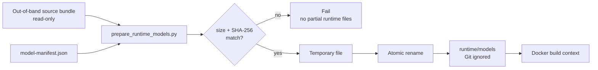
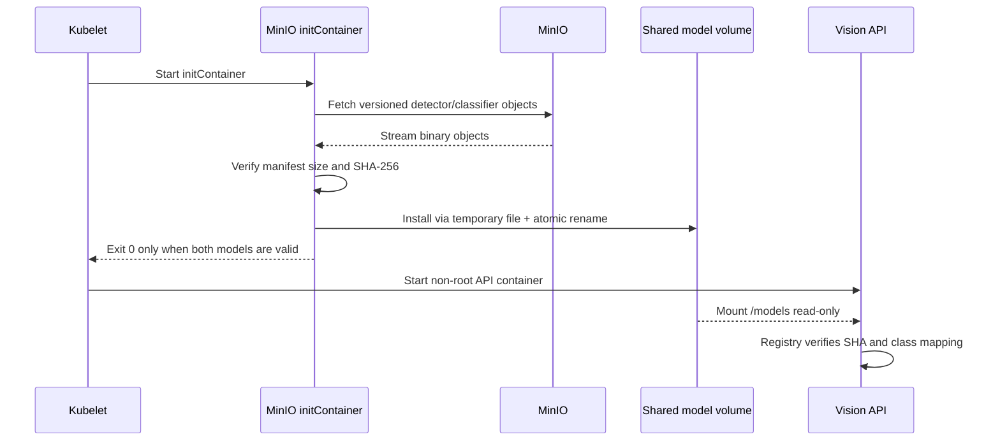

# Model Management

## 기본 원칙

두 승인 모델은 소스 코드와 별도로 배포합니다. `.pt` 파일은 Git에 커밋하지
않고, Docker build 또는 Kubernetes 시작 전에 크기와 SHA-256을 검증합니다.
모델을 Python으로 load하여 확인하는 방식은 준비 단계에서 사용하지 않습니다.

Git에서 추적하는 계약은 다음 두 파일입니다.

- `models/model-manifest.json`
- `scripts/prepare_runtime_models.py`

manifest는 모델 binary의 위치가 아니라 승인된 정체성을 기록합니다. host의
절대 source path, 사용자명, credential 및 임시 URL을 기록해서는 안 됩니다.

## Manifest 계약

각 모델 항목은 최소한 다음 정보를 가져야 합니다.

- 안정적인 model ID와 공개 model name
- 역할: species detector 또는 health classifier
- framework/task/architecture
- source artifact의 논리적 상대 경로
- runtime 대상 상대 경로
- byte 크기와 전체 SHA-256
- 입력 크기
- 공개 class mapping과 실제 weight의 raw class mapping
- 현재 검증 범위와 알려진 제한사항

현재 runtime 대상은 다음으로 고정합니다.

| 역할 | Runtime staging | Container |
| --- | --- | --- |
| Species detector | `runtime/models/detector/best.pt` | `/models/detector/best.pt` |
| Health classifier | `runtime/models/health/best.pt` | `/models/health/best.pt` |

manifest 값과 `scripts/predict_mushroom_health.py`의 승인된 size/SHA-256,
모델 이름, class mapping 및 입력 크기는 테스트에서 항상 일치해야 합니다.
health 모델의 공개 mapping인 `HEALTHY`/`DISEASE_SUSPECTED`와 weight 내부
raw mapping인 `0_healthy`/`1_disease_suspected`를 서로 다른 필드로
기록하고 각각의 순서를 검증합니다. 같은 정보를 수동으로 각각 수정한 채
merge하지 않습니다.

## 로컬 준비 절차



권장 명령은 Make target을 사용합니다.

```bash
make prepare-models
make check-models
```

준비 스크립트는 다음 안전 속성을 가져야 합니다.

1. source 파일을 read-only로 열고 수정하지 않음
2. manifest의 절대경로와 `..` traversal을 거부함
3. 선택된 두 파일만 chunk 단위로 읽음
4. byte 크기와 SHA-256을 모두 검증함
5. 임시 파일을 같은 destination filesystem에 만들고 원자적으로 rename함
6. 두 source를 먼저 모두 검증하고 각 destination에 incomplete 파일을
   활성화하지 않음
7. 기존 파일이 동일하면 idempotent하게 종료함
8. 기존 파일이 다르면 묵시적으로 덮어쓰지 않음
9. 출력 메시지와 생성 파일에 source 절대경로를 기록하지 않음

`runtime/models/**/*.pt`는 생성물이며 Git에 포함하지 않습니다. 디렉터리
용도를 설명하는 작은 README만 추적합니다. 준비 스크립트가 읽는 source
모델도 manifest가 지정한 Git-ignored `artifacts/models/...` 위치에만 두며,
Git-tracked 디렉터리나 Docker context에 원본 bundle 전체를 복사하지
않습니다.

## 변경과 승인

모델 교체는 코드 PR과 같은 검토 수준으로 처리합니다.

1. 새 모델의 provenance, split, 클래스 및 평가 보고서를 검토합니다.
2. 새 object를 기존 object와 다른 version key로 업로드합니다.
3. manifest의 size/SHA/class 정보를 갱신합니다.
4. manifest와 predictor 계약 일치 테스트를 실행합니다.
5. synthetic 기본 테스트를 실행합니다.
6. 명시적 승인 환경에서만 실제 registry load smoke test를 실행합니다.
7. staging 승인을 받은 digest만 production으로 promotion합니다.

기존 runtime bundle이 새 승인본과 다를 때만 명시적으로 교체합니다.

```bash
python scripts/prepare_runtime_models.py --overwrite
python scripts/prepare_runtime_models.py --check-only
```

동일 object key를 덮어쓰지 않습니다. rollback은 이전 manifest와 immutable
object version을 다시 지정하는 방식으로 수행합니다.

## MinIO initContainer 계획

클러스터에서는 model binary를 Git 또는 일반 application image layer에
의존하지 않는 구성을 목표로 합니다.



구현 시 지켜야 할 사항:

- `TODO(MINIO_IMAGE)`: 승인 digest로 고정한 MinIO client/init image
- `TODO(MINIO_ENDPOINT)`: cluster 내부 endpoint
- `TODO(MINIO_BUCKET)`: 전용 bucket
- `TODO(MINIO_OBJECT_KEYS)`: versioned detector/classifier object keys
- credential은 Kubernetes Secret으로만 주입
- manifest 또는 object metadata는 ConfigMap/immutable image에서 제공
- initContainer의 model volume mount는 writable
- application container의 같은 volume mount는 `readOnly: true`
- 실패한 checksum은 Pod startup 실패로 처리
- 로그에는 credential, presigned URL 및 local node path를 남기지 않음
- NetworkPolicy로 initContainer의 MinIO 접근만 허용

`TODO(NAMESPACE)`, Secret 이름, ServiceAccount 및 object retention 정책은
플랫폼 팀과 확정하기 전 문서 예시에도 실제 값처럼 적지 않습니다.

## Docker 프로토타입과 클러스터 차이

`Dockerfile.template`은 로컬 handoff를 위해 검증된 `runtime/models`를
read-only image layer로 복사합니다. Kubernetes 목표 구조에서는 `/models`
volume mount가 image 경로를 대체합니다. 두 방식 모두 애플리케이션이 보는
경로와 SHA 검증 계약은 같습니다.

모델 라이선스와 AIHub 재배포 조건을 확인하기 전에는 Git LFS, public release,
public image에 binary를 게시하지 않습니다.

## 필수 테스트

- 유효한 synthetic source 두 개의 atomic 준비
- size mismatch와 SHA mismatch 거부
- 부분 실패 시 runtime bundle 미활성화
- 기존 동일 파일의 idempotency
- 기존 불일치 파일의 무승인 overwrite 거부
- manifest path traversal 및 symlink escape 거부
- source size/mtime/hash 불변
- manifest와 predictor 모델 계약 일치
- 출력 및 manifest의 로컬 절대경로 비노출
- 기본 pytest에서 실제 모델 미로드
- `RUN_MODEL_INTEGRATION_TESTS=true`일 때만 실제 registry load 허용
